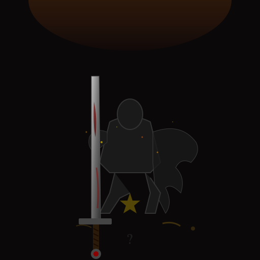
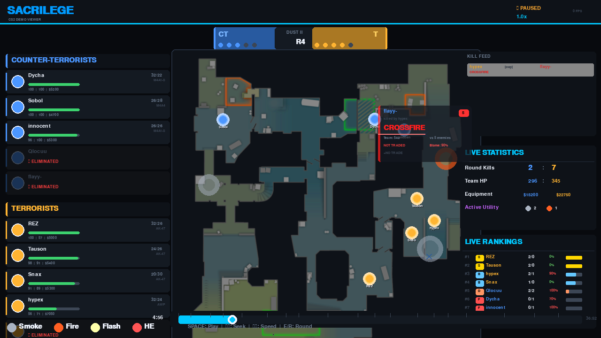

<div align="center">



# SACRILEGE ENGINE

### A Real-Time CS2 Demo Analysis System with Blame Attribution

[](https://python.org)
[](https://counter-strike.net)
[](LICENSE)
[]()

---

**Contact:** [mahadevan.rajeev27@gmail.com](mailto:mahadevan.rajeev27@gmail.com)

</div>

---

## Abstract

**Sacrilege Engine** is a deterministic CS2 demo analysis system that provides real-time death attribution and performance grading. Unlike traditional post-match statistics, this system assigns **blame scores** to individual deaths, classifying tactical mistakes across **15 categories** and generating **S-F performance grades** in real-time. The system processes `.dem` files and renders an interactive radar replay with live statistics, kill feed with death reasons, and performance rankings.

**Keywords:** Counter-Strike 2, Demo Analysis, Tactical Mistakes, Performance Metrics, Radar Visualization

---

## I. Introduction

Traditional CS2 analysis tools focus on aggregate statistics (K/D, ADR, KAST) that fail to explain *why* a player died. Sacrilege Engine addresses this gap by:

1. **Classifying each death** into tactical mistake categories
2. **Assigning blame scores** (0-100%) based on situational factors
3. **Generating performance grades** (S/A/B/C/D/F) in real-time
4. **Visualizing deaths** with detailed popup analytics

The system is designed for individual improvement rather than team strategy, making it complementary to existing coaching tools.

---

## II. System Architecture

```
┌─────────────────────────────────────────────────────────────────┐
│                        SACRILEGE ENGINE                         │
├─────────────────────────────────────────────────────────────────┤
│                                                                 │
│  ┌──────────────┐    ┌──────────────┐    ┌──────────────┐      │
│  │  Demo Parser │───▶│Death Analyzer│───▶│Radar Replayer│      │
│  │ (demoparser2)│    │  (15 types)  │    │  (pygame)    │      │
│  └──────────────┘    └──────────────┘    └──────────────┘      │
│         │                   │                   │               │
│         ▼                   ▼                   ▼               │
│  ┌──────────────┐    ┌──────────────┐    ┌──────────────┐      │
│  │ Player Data  │    │ Blame Scores │    │  Live UI     │      │
│  │ Tick-by-tick │    │ Performance  │    │  Rankings    │      │
│  └──────────────┘    └──────────────┘    └──────────────┘      │
│                                                                 │
└─────────────────────────────────────────────────────────────────┘
```

**Fig. 1:** System architecture showing data flow from demo parsing to visualization.

### A. Demo Parser Module

Extracts tick-by-tick player positions, health, equipment, and events using the `demoparser2` library.

### B. Death Analyzer Module

The core intelligence module that classifies deaths into 15 mistake types:

| Category | Severity | Description |
|:---------|:--------:|:------------|
| `ISOLATED` | 5 | No teammate within 800 units |
| `CROSSFIRE` | 5 | Exposed to 2+ enemy angles |
| `SOLO_PUSH` | 5 | Advanced alone into enemy territory |
| `OUTNUMBERED` | 4 | Engaged against numerical disadvantage |
| `NO_TRADE` | 4 | Death not traded within 3 seconds |
| `FLASHED` | 3 | Killed while flashbang-blinded |
| `SMOKED` | 3 | Killed through/near smoke |
| `MOLLIED` | 3 | Killed in molotov damage |
| `BAITED` | 4 | Teammate nearby but didn't engage |
| `OVERPEEK` | 3 | Extended peek beyond cover |
| `WHIFF` | 2 | Missed shots before death |
| `ECO_FORCE` | 2 | Died on eco/force buy round |
| `CLUTCH` | 1 | Last alive, reduced blame |
| `ENTRY` | 2 | First contact of round |
| `FAIR_DUEL` | 1 | Lost even gunfight |

**Table I:** Death classification categories with severity ratings.

### C. Radar Replayer Module

Renders interactive replay with:
- Real-time player positions and view angles
- Utility visualization (smokes, mollies, flashes)
- Kill feed with death reasons
- Death analysis popups
- Live performance rankings

---

## III. Methodology

### A. Blame Score Calculation

The blame score quantifies individual responsibility for a death:

```
Blame = Base_Severity × Position_Factor × Context_Modifier
```

Where:
- **Base_Severity:** Primary mistake severity (1-5)
- **Position_Factor:** Distance to nearest teammate (normalized)
- **Context_Modifier:** Round state, economy, numbers advantage

### B. Performance Grading

Real-time grades are calculated using:

```
Score = (Kills / Deaths) × 40 - Average_Blame + 20

Grade Thresholds:
  S: 80+    A: 65+    B: 50+    C: 35+    D: 20+    F: <20
```

---

## IV. Implementation

### A. Installation

```bash
git clone https://github.com/Pl4yer-ONE/Sacrilege_Engine.git
cd Sacrilege_Engine
python -m venv venv && source venv/bin/activate
pip install -e .
```

### B. Usage

```bash
python radar/radar_replayer.py "path/to/demo.dem"
```

### C. Controls

| Key | Action |
|:---:|:-------|
| `SPACE` | Play / Pause |
| `←` `→` | Seek ±5 seconds |
| `↑` `↓` | Adjust playback speed |
| `E` `R` | Previous / Next round |
| `M` | Toggle heatmap overlay |
| `B` | Add bookmark |
| `J` | Export to JSON |
| `F12` | Screenshot to Downloads |
| `H` | Help overlay |
| `F` | Fullscreen |
| `HOME` / `END` | Jump to start / end |
| Click | Select player card |

---

## V. Results

### A. Output Screenshot



**Fig. 2:** Radar replayer showing player positions, kill feed with death reasons, live statistics, and performance rankings.

### B. Demo Videos

| Map | Match | Duration |
|:----|:------|:---------|
| [Dust II](docs/radar_dust2.mp4) | GamerLegion vs Venom | 10s |
| [Mirage](docs/radar_mirage.mp4) | EC Banga vs Semperfi | 10s |

### C. Validation Results

Tested across 4 maps with 330 deaths analyzed:

| Map | Deaths | Top Mistakes |
|:----|:------:|:-------------|
| de_dust2 | 81 | CROSSFIRE (54%), ISOLATED (38%) |
| de_ancient | 75 | CROSSFIRE (55%), ISOLATED (37%) |
| de_overpass | 89 | CROSSFIRE (62%), ISOLATED (28%) |
| de_mirage | 85 | CROSSFIRE (65%), ISOLATED (27%) |

**Table II:** Death analysis distribution across competitive maps.

---

## VI. Project Structure

```
Sacrilege_Engine/
├── src/
│   ├── parser/                 # Demo file parsing
│   │   └── demo_parser.py
│   ├── intelligence/           # Analysis modules
│   │   └── death_analyzer.py   # Core blame attribution
│   └── visualization/          # Heatmap generation
├── radar/
│   ├── radar_replayer.py       # Main application
│   └── maps/                   # Radar overlays (8 maps)
├── docs/
│   ├── ARCHITECTURE.md         # Technical documentation
│   ├── TECHNICAL_PAPER.md      # IEEE-format paper
│   └── images/                 # Screenshots and diagrams
└── tests/                      # Unit tests
```

---

## VII. Conclusion

Sacrilege Engine provides actionable, individual-level feedback that traditional analysis tools lack. By assigning blame to each death, players receive immediate insight into tactical mistakes rather than abstract statistics.

### Future Work

1. **Machine Learning Integration:** Train models on professional matches to improve mistake classification
2. **Team Coordination Analysis:** Extend blame attribution to team-wide coordination failures
3. **Web Dashboard:** Browser-based interface for remote analysis

---

## VIII. References

1. Valve Corporation, "Counter-Strike 2," 2023.
2. demoparser2, "CS2 Demo Parser Library," GitHub, 2024.
3. boltobserv, "CS2 Radar Map Overlays," GitHub, 2023.

---

## License

**PolyForm Noncommercial License 1.0.0**

Free for personal and educational use. Commercial use requires explicit permission.

---

## Contact

**Author:** Pl4yer-ONE  
**Email:** [mahadevan.rajeev27@gmail.com](mailto:mahadevan.rajeev27@gmail.com)  
**Repository:** [github.com/Pl4yer-ONE/Sacrilege_Engine](https://github.com/Pl4yer-ONE/Sacrilege_Engine)

---

<div align="center">

*"The truth hurts. Sacrilege delivers it anyway."*

</div>
