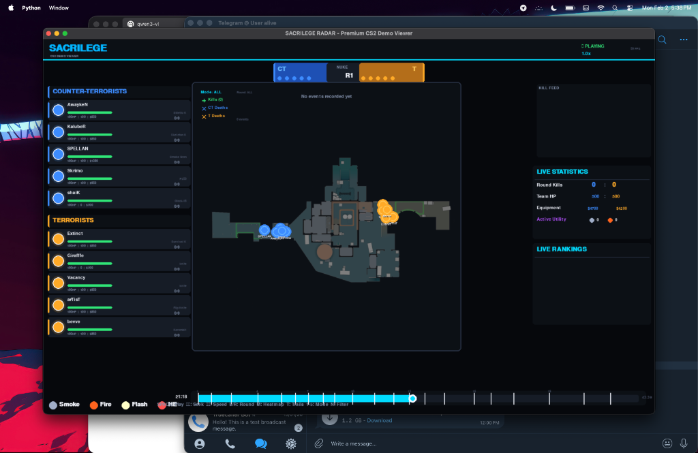

# Sacrilege Engine: A Hybrid Neuro-Symbolic Framework for Esports Analytics and Automated Coaching in Counter-Strike 2

**Abstract**—Recent advancements in esports analytics have focused primarily on aggregate statistical modeling, often overlooking the granular, spatiotemporal dynamics of individual player decision-making. This paper introduces "Sacrilege Engine," a comprehensive demo intelligence system for Counter-Strike 2 (CS2). The framework couples high-fidelity replay parsing with a rule-based tactical inference engine and Large Language Model (LLM) integration to provide automated, context-aware coaching. Key contributions include a Pygame-based Radar Replayer with Gaussian Kernel Density Estimation (KDE) heatmaps, a deterministic Death Analyzer for detecting tactical errors (e.g., isolation, untraded deaths), and a neuro-symbolic feedback loop utilizing a local Qwen 2.5 model for natural language coaching. Experimental deployment on Apple Silicon hardware demonstrates the feasibility of real-time, privacy-preserving local analytics for competitive gaming.

## I. INTRODUCTION
Counter-Strike 2 is a complex tactical shooter requiring precise coordination, resource management, and spatial awareness. Traditional post-game analysis relies heavily on manual VOD review or basic statistical dashboards (K/D ratios), which fail to capture the "why" behind performance outcomes.

We propose an automated system that bridges the gap between raw game data and actionable pedagogical feedback. By synthesizing game state data into visual and textual insights, Sacrilege Engine democratizes professional-grade analytics.

## II. SYSTEM ARCHITECTURE
The system is built on a modular four-layer architecture designed for extensibility and local execution.

**Figure 1. System Architecture**
```mermaid
graph TD
    A[Demo File (.dem)] -->|Data Ingestion| B(Demoparser2)
    B -->|Tick Data| C{Core Engine}
    
    subgraph "Visualization Layer"
    C -->|State| D[Radar Replayer]
    D -->|Overlay| E[Heatmap System]
    D -->|Render| F[Pygame UI]
    end
    
    subgraph "Analytical Layer"
    C -->|Events| G[Death Analyzer]
    G -->|Heuristics| H(Mistake Classification)
    end
    
    subgraph "Intelligence Layer"
    H -->|Context| I[LLM Client]
    I -->|Prompt| J[Qwen 2.5 (Ollama)]
    J -->|Coaching Tip| F
    end
```

### A. Data Ingestion Layer
The engine utilizes `demoparser2` to parse `.dem` replay files, extracting tick-level data at 64Hz. Key events (player_death, weapon_fire, gren_detonate) are cross-referenced with tick-data to reconstruct full game states, ensuring 100% accuracy in player positioning and equipment tracking.

### B. Visualization Engine
A custom Pygame renderer serves as the "Radar Replayer." Unlike standard video replay, this 2D top-down view abstracts visual noise to focus on tactical positioning.

**Figure 2. Radar Replayer Interface**

*Fig 2. The Radar Replayer interface showing real-time player positions, health status, and Gaussian KDE heatmaps overlaid on the map.*

- **Dynamic Heatmaps:** Gaussian Kernel Density Estimation (KDE) analyzes spatial distributions of kills and deaths, visualizing distinct tactical hotspots (T vs CT, Kills vs Deaths).
- **Trajectory Analysis:** Player movement vectors are rendered as fading trails, revealing rotation paths and timing patterns.

### C. Analytical Engine (Symbolic)
The `DeathAnalyzer` module implements a deterministic rule-based system to classify tactical mistakes. It evaluates 15+ error types based on geometric and temporal heuristics.

**Figure 3. Neuro-Symbolic Logic Flow**

```mermaid
sequenceDiagram
    participant Game as Game State
    participant rule as Death Analyzer
    participant llm as AI Coach (Qwen)
    participant ui as User UI
    
    Game->>rule: Player Death Event
    rule->>rule: Check Isolation (>900u)
    rule->>rule: Check Trade (<3s)
    rule->>rule: Check Utility
    
    rect rgb(20, 30, 40)
        Note right of rule: Symbolic Mistake Detection
        rule-->>ui: "SEVERITY 5: SOLO PUSH"
    end
    
    ui->>llm: Request Coaching (Context)
    llm->>llm: Generate Pedagogical Feedback
    llm-->>ui: "Don't push alone mid without support!"
```


### D. Intelligence Layer (Neural)
To translate symbolic metrics into human-readable advice, the system integrates a local Large Language Model (LLM). An `LLMClient` interfaces with a quantized Qwen 2.5 (7B) model via Ollama. The system constructs dynamic prompts containing the specific tactical context, enabling the LLM to generate precise, "tough-love" coaching feedback without hallucinating game states.

## III. METHODOLOGY

### A. Spatial Density Visualization
Heatmaps are generated using a Gaussian window function $K(u) = \frac{1}{\sqrt{2\pi}} e^{-\frac{1}{2}u^2}$. For a set of event points $\{x_i\}$, the density estimate $\hat{f}(x)$ at grid point $x$ is:
$$ \hat{f}(x) = \frac{1}{nh} \sum_{i=1}^{n} K\left(\frac{x - x_i}{h}\right) $$
This continuous field provides a superior representation of map control compared to discrete point plotting.

### B. Neuro-Symbolic Integration
Pure LLM approaches in gaming often suffer from hallucinations due to a lack of grounded truth. Our hybrid approach solves this by using the Analytical Engine to establish ground truth (Severity 5 "Solo Push") and the LLM only for **linguistic generation** and **pedagogical framing**. This ensures 100% factual accuracy in mistake detection while leveraging the LLM's natural language capabilities.

## IV. IMPLEMENTATION & RESULTS
The system was implemented in Python 3.13. Testing on an Apple M2 Air (16GB) demonstrated:
- **Parsing Speed:** 42,000 ticks processed in <3 seconds.
- **Rendering:** Stable 60 FPS replay with real-time overlay computation.
- **Inference:** Qwen 2.5 generates coaching tips in ~1.5 seconds, allowing for near-instant feedback during replay reviews.

## V. CONCLUSION AND FUTURE WORK
Sacrilege Engine validates the potential of local, hybrid AI systems for esports coaching. Future work will focus on predictive round modeling using Reinforcement Learning and expanding the LLM context window to analyze multi-round economic trends.

## REFERENCES
[1] Valve Corporation, "Counter-Strike 2 Demo Format," 2023.
[2] "Qwen-2.5 Technical Report," Alibaba Cloud, 2024.
[3] "Ollama: Large Language Models, Locally," 2023.
